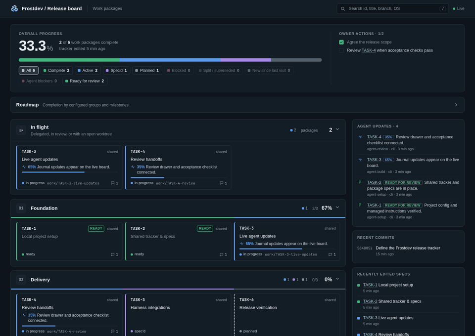
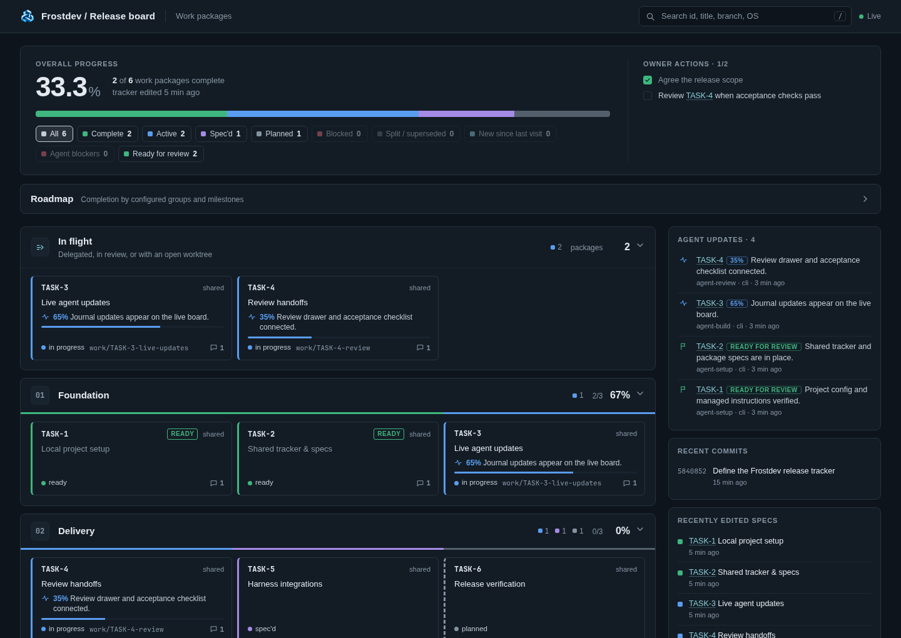
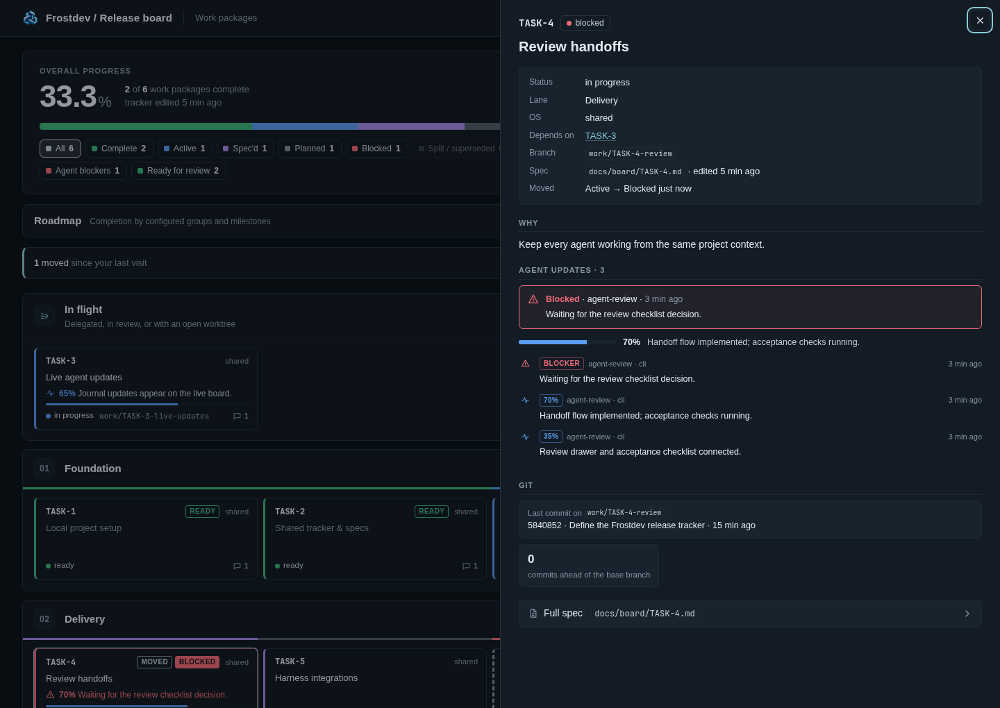
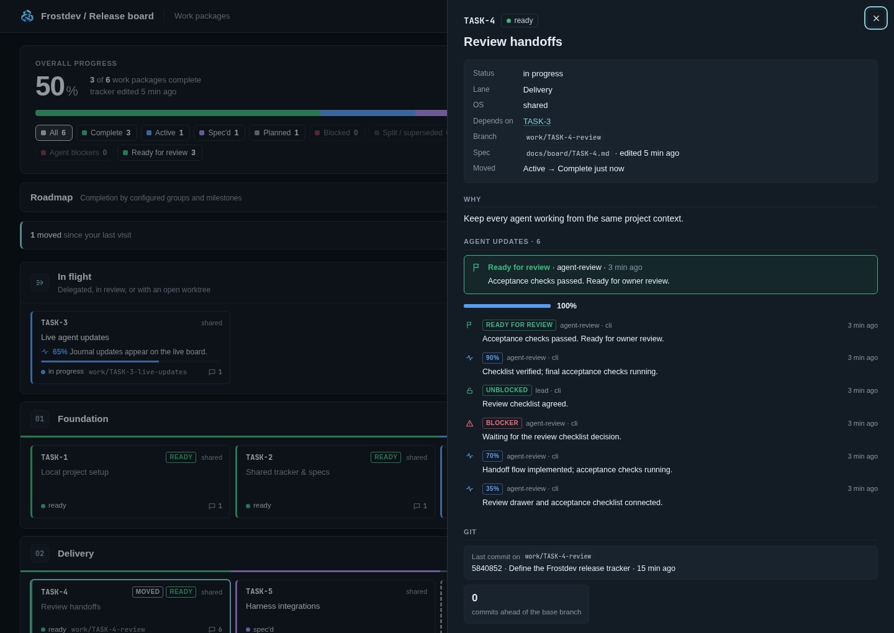

<p align="center">
  
</p>

<p align="center">
  <strong>Many agents. One clear view.</strong><br>
  Plans, progress, blockers, and review handoffs. Live on your machine.
</p>

<p align="center">
  <a href="#install">Get started</a> ·
  <a href="#see-it-move">See the board</a> ·
  <a href="docs/CONFIGURATION.md">Make it yours</a> ·
  <a href="https://github.com/frostdev-ops/rimewire/issues">Report an issue</a>
</p>

<p align="center">
  <a href="https://github.com/frostdev-ops/rimewire/actions/workflows/check.yml"></a>
  
  
  <a href="LICENSE"></a>
</p>

## Keep the work in view

Turn scattered agent sessions and Git worktrees into one live project board. Agents share context through a local MCP server; you follow the work in your browser.

<p align="center">
  
</p>

| Shared context | Visible progress | Yours to shape |
| --- | --- | --- |
| Specs, dependencies, and updates across checkouts. | Live status, branches, blockers, and review handoffs. | Your tracker, your branding, local data. No cloud service or model API required. |

Works with **Claude Code, Codex, OpenCode, and Pi**. Sandboxed agents can post updates through the local CLI.

## See it move

<p align="center">
  <a href="assets/readme/goldens/board-overview.png"></a>
</p>

*A Frostdev demo project, captured from the running board. Click for a still view.*

<details>
<summary>Explore the board</summary>

**The whole project at a glance**



**Blockers with context**



**A clear handoff for review**



</details>

## Install

Requires **Node.js 24+** and npm. Build and install from source:

```sh
git clone https://github.com/frostdev-ops/rimewire.git
cd rimewire
npm ci
npm run build
npm install --global .
```

Keep the installed checkout available; rerun harness registration after updates or moves.

### Codex, OpenCode, or Pi

Run the command for your harness:

```sh
rimewire install codex --user
rimewire install opencode --user
rimewire install pi --user
```

Restart your harness in the project, run **`rimewire-setup`**, then ask for **`board_url`**. Setup adapts the tracker, board, and agent instructions to your project.

Use `--project` for checkout-specific registration. [Installation and removal →](docs/INSTALLATION.md)

### Claude Code

From the built Rimewire checkout:

```sh
claude plugin marketplace add "$PWD/plugins"
claude plugin install rimewire@rimewire-local
```

Restart Claude Code in your project, run **`/rimewire:rimewire-setup`**, then ask for **`board_url`**. [Plugin guide →](docs/CLAUDE_PLUGIN.md)

## A few useful commands

From your configured project, using IDs from your tracker:

```sh
rimewire list
rimewire progress TASK-1 --percent 50 --text "Parser implemented"
rimewire blocker TASK-1 --text "Waiting for the input format decision"
rimewire ready TASK-1 --text "Acceptance checks passed"
rimewire serve --repo .
```

Post `ready` after checks pass. Later progress or blockers reopen the package. Keep checkout-local journals gitignored; version your config and tracker.

## Documentation

| Start here | Go deeper |
| --- | --- |
| [Installation and removal](docs/INSTALLATION.md) | [MCP tools](docs/MCP.md) |
| [Configuration](docs/CONFIGURATION.md) · [Example tracker](examples/tracker.md) | [Board lifecycle](docs/LIFECYCLE.md) |
| [Claude Code](docs/CLAUDE_PLUGIN.md) · [Codex](docs/CODEX.md) | [OpenCode](docs/OPENCODE.md) · [Pi](docs/PI.md) |

## Development

```sh
npm ci
npm run check
npm run format
```

`check` covers types, tests, lint, and the plugin build. **Python 3** is needed for test-only reference checks; the runtime is Node.js. [Regenerate the demo and goldens →](assets/readme/README.md)

## Contributing

[Open an issue](https://github.com/frostdev-ops/rimewire/issues) with reproduction steps, or send a focused PR with relevant checks and docs. Run `npm run check` before submitting.

---

Part of [Frostdev](https://frostdev.io), alongside [Rimeward](https://github.com/frostdev-ops/rimeward), [Frostsim](https://github.com/frostdev-ops/frostsim), and [Crosspane](https://github.com/frostdev-ops/crosspane). Licensed under [GPL-3.0-or-later](LICENSE).
